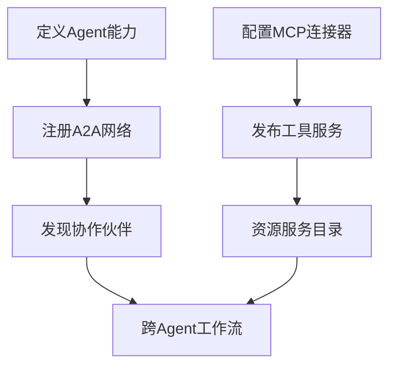

# AI新基建 #技术共生

## A2A与MCP的Protocol Co-Evolution

🌟 **AI生态的双子星：Google A2A与Anthropic MCP的协同进化** 🌟

**当我们在讨论AI的未来时，真正的革命或许不在于单一技术的突破，而在于如何让不同系统“对话”。**  
Google的A2A与Anthropic的MCP看似分属不同赛道，实则构成AI生态的“任督二脉”——一个打通智能体间的协作网络，一个连接模型与数字世界的接口。二者的结合，正在描绘一幅更完整的AI互联图景。

### 🔍 重新定位：技术矩阵的互补关系

**A2A（横向互联）**：  
🌐 构建智能体间的"社交网络"  

- 解决**跨平台发现**与**安全通信**问题  
- 类比互联网的TCP/IP协议，定义AI交互的"交通规则"

**MCP（纵向贯通）**：  
🔌 打造模型与资源的"万能插座"  

- 统一**工具调用**与**数据访问**标准  
- 类似计算机的USB接口，标准化AI的"外设连接"

**协同效应**：  
▸ 通过A2A组网的智能体集群，可通过MCP统一调用工具与数据  
▸ MCP集成的外部资源，可通过A2A协议被分布式智能体共享  

### 🛠️ 技术融合的三大实践场景

#### 场景1：企业智能中台

- **A2A层**：财务AI + 供应链AI + 客服AI组成联邦网络  
- **MCP层**：统一访问ERP/SAP/CRM系统  
- **价值体现**：预算调整自动触发全链条协同响应  

#### 场景2：科研智能体联盟

- **A2A网络**：跨机构的实验AI、文献分析AI、计算集群AI  
- **MCP接口**：对接电子显微镜API + 学术数据库 + 超算平台  
- **突破性应用**：自主设计新材料研发流程  

#### 场景3：城市数字孪生

- **A2A协作**：交通管理AI + 环境监测AI + 应急响应AI  
- **MCP集成**：实时接入物联网传感器 + 政务系统API  
- **创新价值**：暴雨预警自动触发地铁限流+抢险调度  

### 📐 架构层的深度耦合

```plaintext
                            +-------------------+
                            |  外部资源层         |
                            | (数据库/API/工具)   |
                            +---------▲---------+
                                      │ MCP协议
+---------------+          +-------------▼---------+
| 智能体网络层   │ A2A       |       模型执行层        |
| (Agent集群)   ◄───────►    (LLM+工具调用引擎)       |
+---------------+          +-----------------------+
```

**数据流范例**：  

1. 客服AI（A2A节点）接收用户请求  
2. 通过MCP调用CRM系统查询订单  
3. 经由A2A网络调度物流AI获取配送信息  
4. 整合结果通过MCP生成定制化回复  

### 🌱 生态共建的关键路径

#### 标准互认

- **元数据对齐**：A2A的Agent Card与MCP的资源描述Schema互通  
- **安全体系融合**：OAuth2.0认证链贯穿代理间通信与资源访问  

#### 开发者工具链

- **联合调试沙盒**：同时模拟多Agent交互与资源调用场景  
- **跨协议监控**：统一追踪A2A消息流与MCP API调用  

#### 典型开发模式



### 🚨 协同进化的挑战

1. **协议边界管理**  
   - 如何划分智能体自主决策与工具调用的权限边界  
   - 示例：当A2A网络中的Agent通过MCP访问敏感数据时的责任追溯  

2. **混合架构复杂度**  
   - 需要新的性能监测指标：A2A通信延迟 vs MCP调用耗时  
   - 开发调试工具需要同时理解两种协议栈  

3. **安全攻击面扩大**  
   - 攻击者可能通过MCP漏洞渗透A2A网络  
   - 需要建立纵深防御体系：A2A的通信加密 + MCP的细粒度权限  

### 🌈 未来展望：AI互联的「分层解耦」范式

1. **基础层**（MCP）：解决AI与物理世界的连接问题  
2. **协作层**（A2A）：构建智能体社会的基础规则  
3. **应用层**：涌现出超越单系统能力的群体智能  

这种分层架构正在催生**AI时代的"Android系统"**：  

- MCP类比底层硬件驱动  
- A2A类似进程间通信机制  
- 上层应用可专注业务逻辑创新  

**结语**  
与其争论A2A与MCP的技术路线优劣，不如关注二者如何形成「协议共生体」。当横向连接能力与纵向贯通能力结合，我们或许正在见证AI基础设施的「DNA双螺旋结构」诞生。对于企业而言，提前布局这两种协议的融合应用，将是赢得下一代AI竞争的关键筹码。  
